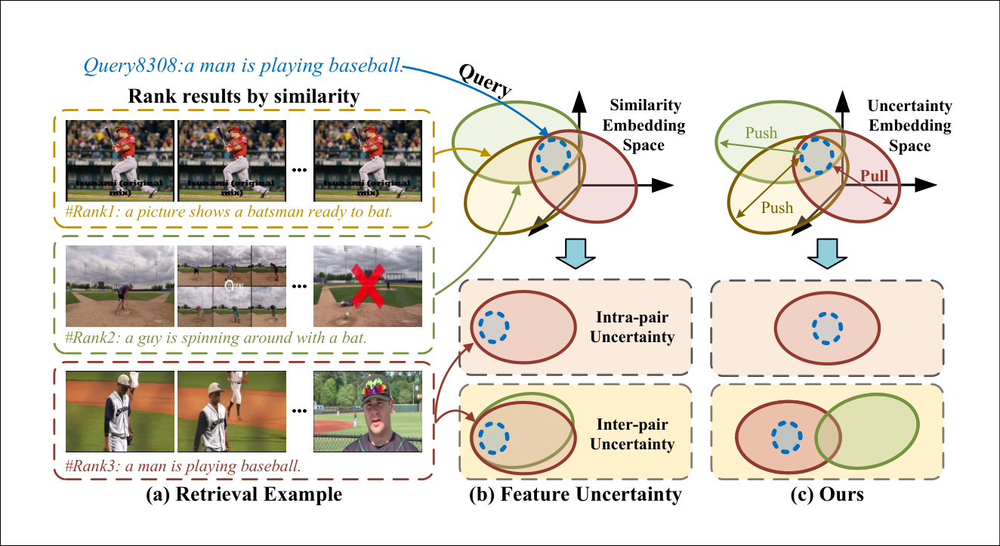
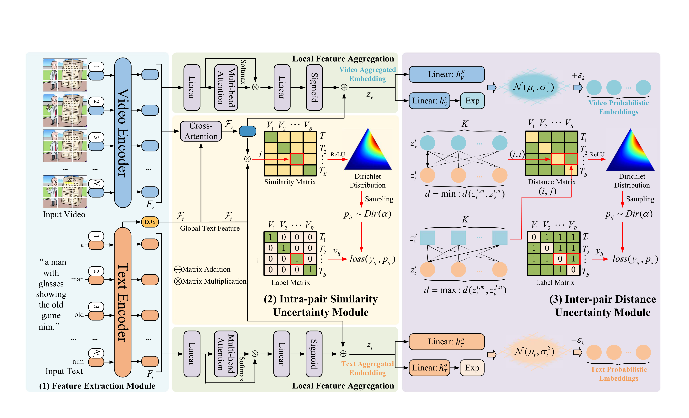

<div align="center">

# IJCAI2025, GuangZhou
# Dual Uncertainty Quantification for Text-Video Retrieval

**Accepted by IJCAI 2025** 🎉

[Paper](https://www.ijcai.org/proceedings/2025/643) | [Code](https://github.com/OPA067/DUQ)

</div>

## 📝 Introduction

We propose a novel **Dual Uncertainty Quantification (DUQ)** model that separately handles two types of uncertainty in text-video retrieval:

- **Intra-pair similarity uncertainty**: Provides similarity-based trustworthy predictions and explicitly models the uncertainty within each text-video pair.
- **Inter-pair distance uncertainty**: Constructs a distance-based diversity probability embedding, widening the gap between similar features across different pairs.

The two components work synergistically, jointly improving the accuracy of cross-modal similarity computation.

## 📣 Updates

| Date | Description |
|------|-------------|
| 2025/01/18 | Released complete training and testing code |
| 2025/04/29 | Paper accepted by IJCAI 2025 |
| 2025/06/01 | Updated code details and documentation |

## 😍 Motivation
<p float="left">
  
</p>

## 🏗️ Framework
<p float="left">
  
</p>

## 🚀 Quick Start

### 1. Environment Setup

```bash
# Create conda environment
conda create -n DUQ python=3.9
conda activate DUQ

# Install dependencies
pip install -r requirements.txt
pip install torch==1.8.1+cu102 torchvision==0.9.1+cu102 -f https://download.pytorch.org/whl/torch_stable.html
```

### 2. Download CLIP Model

Place the pretrained CLIP model in the `models/` directory:

```bash
cd DUQ/models

# ViT-B/32 (default)
wget https://openaipublic.azureedge.net/clip/models/40d365715913c9da98579312b702a82c18be219cc2a73407c4526f58eba950af/ViT-B-32.pt

# ViT-B/16 (optional)
# wget https://openaipublic.azureedge.net/clip/models/5806e77cd80f8b59890b7e101eabd078d9fb84e6937f9e85e4ecb61988df416f/ViT-B-16.pt

# ViT-L/14 (optional)
# wget https://openaipublic.azureedge.net/clip/models/b8cca3fd41ae0c99ba7e8951adf17d267cdb84cd88be6f7c2e0eca1737a03836/ViT-L-14.pt
```

### 3. Download Datasets

| Dataset | Download Link |
|---------|---------------|
| MSRVTT | [Download](http://ms-multimedia-challenge.com/2017/dataset) |
| LSMDC | [Download](https://sites.google.com/site/describingmovies/download) |
| ActivityNet | [Download](http://activity-net.org/download.html) |
| Charades | [Download](https://github.com/activitynet/ActivityNet) |
| DiDeMo | [Download](https://github.com/LisaAnne/LocalizingMoments) |
| VATEX | [Download](https://eric-xw.github.io/vatex-website/download.html) |

### 4. Training

```bash
# Single GPU
CUDA_VISIBLE_DEVICES=0 python -m torch.distributed.launch \
    --master_port 2501 \
    --nproc_per_node=1 \
    main_retrieval.py \
    --do_train 1 \
    --workers 8 \
    --n_display 100 \
    --epochs 5 \
    --lr 1e-4 \
    --coef_lr 1e-3 \
    --batch_size 32 \
    --batch_size_val 32 \
    --anno_path MSRVTT \
    --video_path MSRVTT/videos \
    --datatype msrvtt \
    --max_words 32 \
    --max_frames 12 \
    --video_framerate 1 \
    --output_dir experiments/MSRVTT

# Multi-GPU (e.g., 4 GPUs)
CUDA_VISIBLE_DEVICES=0,1,2,3 python -m torch.distributed.launch \
    --master_port 2501 \
    --nproc_per_node=4 \
    main_retrieval.py \
    --do_train 1 \
    --workers 8 \
    --n_display 100 \
    --epochs 5 \
    --lr 1e-4 \
    --coef_lr 1e-3 \
    --batch_size 128 \
    --batch_size_val 128 \
    --anno_path MSRVTT \
    --video_path MSRVTT/videos \
    --datatype msrvtt \
    --max_words 32 \
    --max_frames 12 \
    --video_framerate 1 \
    --output_dir experiments/MSRVTT
```

### 5. Evaluation

```bash
CUDA_VISIBLE_DEVICES=0 python -m torch.distributed.launch \
    --master_port 2502 \
    --nproc_per_node=1 \
    main_retrieval.py \
    --do_eval 1 \
    --workers 8 \
    --n_display 100 \
    --batch_size 32 \
    --batch_size_val 32 \
    --anno_path MSRVTT \
    --video_path MSRVTT/videos \
    --datatype msrvtt \
    --max_words 32 \
    --max_frames 12 \
    --video_framerate 1 \
    --output_dir experiments/MSRVTT \
    --init_model experiments/MSRVTT/<RUN_NAME>/pytorch_model.bin.<EPOCH>
```

> 📌 For more details, refer to the [`script/`](https://github.com/OPA067/DUQ/tree/master/script) directory.

## 💪 Experiments

Training logs and checkpoints are saved under `experiments/<dataset>/<timestamp>/`.

### Log File Format

Each experiment generates a `log.txt` file containing:

**1. Configuration Parameters**
```
[2026-09-03 10:42:53 Model 170 INFO]: Effective parameters:
  <<< agg_module: seqTransf
  <<< alpha: 0.1
  <<< base_encoder: ViT-B/32
  ...
```

**2. Model Statistics**
```
Total params: 185.48M
Trainable params: 183.12M
```

**3. Zero-shot Evaluation (Before Training)**
```
T->V: R@1: 31.6 - R@5: 56.4 - R@10: 66.3 - MdR: 4.0 - MnR: 30.1
V->T: R@1: 33.2 - R@5: 57.5 - R@10: 66.4 - MdR: 4.0 - MnR: 27.7
```

**4. Training Progress**
```
eta: 4:19:13, epoch: 1/5, iter: 4300/5625, loss: 0.6159, lr: 0.000000094
```

| Field | Description |
|-------|-------------|
| `eta` | Estimated time remaining |
| `epoch` | Current epoch / total epochs |
| `iter` | Current iteration / total iterations |
| `loss` | Training loss value |
| `lr` | Learning rate |
| `memory` | GPU memory usage |

### Example Results (MSRVTT)

| Metric | Text→Video | Video→Text |
|--------|------------|------------|
| R@1 | 31.6 | 33.2 |
| R@5 | 56.4 | 57.5 |
| R@10 | 66.3 | 66.4 |
| MdR | 4.0 | 4.0 |
| MnR | 30.1 | 27.7 |

## 📁 Project Structure

```
DUQ/
├── main_retrieval.py          # Main entry point for training & evaluation
├── models/
│   ├── modeling.py            # Core DUQ model
│   ├── module_clip.py         # CLIP backbone
│   ├── module_prob.py         # Probabilistic embedding module
│   ├── module_edl.py          # Evidential deep learning module
│   ├── module_cross.py        # Cross-modal Transformer
│   └── module_transformer.py  # Temporal Transformer
├── dataloaders/               # Dataset loaders for each benchmark
├── utils/                     # Evaluation metrics & helpers
├── script/                    # Training & evaluation scripts
├── experiments/               # Output directory for logs & checkpoints
└── figures/                   # Motivation & framework diagrams
```

## 📊 Key Parameters

| Parameter | Description | Default |
|-----------|-------------|---------|
| `--do_train` | Enable training mode | 0 |
| `--do_eval` | Enable evaluation mode | 0 |
| `--datatype` | Dataset name | msrvtt |
| `--max_words` | Maximum text token length | 24 |
| `--max_frames` | Maximum video frames | 12 |
| `--lr` | Learning rate | 1e-4 |
| `--coef_lr` | CLIP branch LR coefficient | 1e-3 |
| `--epochs` | Training epochs | 5 |
| `--batch_size` | Batch size | 32 |
| `--init_model` | Pretrained checkpoint path | - |
| `--output_dir` | Output directory | experiments/ |

## 🎗️ Acknowledgments

Our code is built upon [Clip4clip](https://github.com/ArrowLuo/CLIP4Clip/), [X-Pool](https://github.com/layer6ai-labs/xpool), and [HBI](https://github.com/jpthu17/HBI/tree/main). We sincerely appreciate their contributions.

## 📚 Citation

If you find this work useful, please cite our paper:

```bibtex
@inproceedings{Liu2025DUQ,
  author    = {Xin Liu and Shibai Yin and Jun Wang and Jiaxin Zhu and Xingyang Wang and Yee-Hong Yang},
  title     = {DUQ: Dual Uncertainty Quantification for Text-Video Retrieval},
  booktitle = {Proceedings of the Thirty-Fourth International Joint Conference on Artificial Intelligence},
  year      = {2025},
  pages     = {5779--5787},
  doi       = {10.24963/ijcai.2025/643}
}
```

## 📄 License

This project is released for academic research use only.
