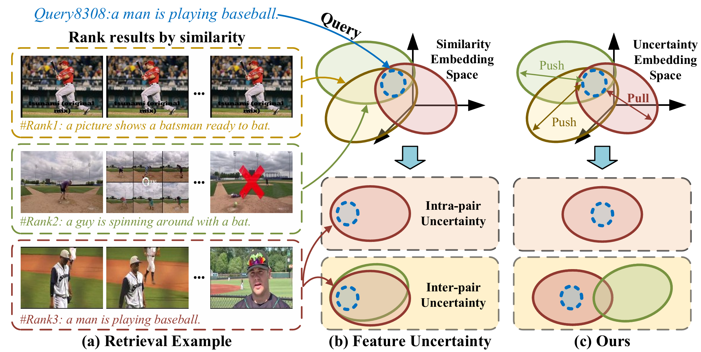
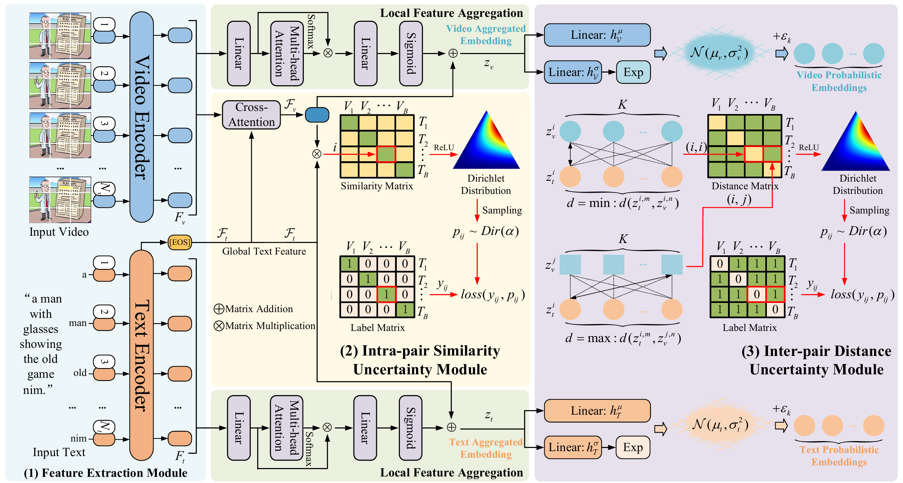

<div align="left">

# [IJCAI2025] DUQ: Dual Uncertainty Quantification for Text-Video Retrieval

Our paper ```DUQ:Dual Uncertainty Quantification for Text-Video Retrieval``` has been accepted by IJCAI2025. In this paper, we propose a novel Dual Uncertainty Quantification (DUQ) model that separately handles uncertainties in intra-pair interaction and inter-pair exclusion. 
Specifically, to enhance intra-pair interaction, we propose an intra-pair similarity uncertainty module to provide similarity-based trustworthy predictions and explicitly model this uncertainty. 
To increase inter-pair exclusion, we propose an inter-pair distance uncertainty module to construct a distance-based diversity probability embeding, thereby widening the gap between similar features. 
The two components work synergistically, jointly improving the calculation of similarity between features. The paper is available at [Paper](https://github.com/OPA067/DUQ/blob/master/papers/DUQ_Main.pdf).

## 📣 Updates
* **[2025/01/18]**: We have released the complete training and testing code.
* **[2025/04/29]**: Our paper has been accepted by IJCAI2025!
* **[2025/06/01]**: We have updated some code details.

## 😍 Motivation & Framework
<p float="left">
  
  
</p>

## 🚀 Quick Start
### Setup

#### Setup code environment
```shell
conda create -n DUQ python=3.9
conda activate DUQ
pip install -r requirements.txt
pip install torch==1.8.1+cu102 torchvision==0.9.1+cu102 -f https://download.pytorch.org/whl/torch_stable.html
```

#### Download CLIP Model
```shell
cd DUQ/models
wget https://openaipublic.azureedge.net/clip/models/40d365715913c9da98579312b702a82c18be219cc2a73407c4526f58eba950af/ViT-B-32.pt
# wget https://openaipublic.azureedge.net/clip/models/5806e77cd80f8b59890b7e101eabd078d9fb84e6937f9e85e4ecb61988df416f/ViT-B-16.pt
# wget https://openaipublic.azureedge.net/clip/models/b8cca3fd41ae0c99ba7e8951adf17d267cdb84cd88be6f7c2e0eca1737a03836/ViT-L-14.pt
```

#### Download Datasets

<div align=center>

|  Datasets   |                             Download Link                              |             Training weights              |
|:-----------:|:----------------------------------------------------------------------:|:-----------------------------------------:|
|   MSRVTT    |      [Download](http://ms-multimedia-challenge.com/2017/dataset)       | [Download](https://github.com/OPA067/DUQ) |
|    LSMDC    | [Download](https://sites.google.com/site/describingmovies/download)| [Download](https://github.com/OPA067/DUQ) |
| ActivityNet |           [Download](http://activity-net.org/download.html)            | [Download](https://github.com/OPA067/DUQ) |
|  Charades   |         [Download](https://github.com/activitynet/ActivityNet)         | [Download](https://github.com/OPA067/DUQ) |
|   DiDeMo    |       [Download](https://github.com/LisaAnne/LocalizingMoments)        | [Download](https://github.com/OPA067/DUQ) |
|    VATEX    |                              [Download](https://eric-xw.github.io/vatex-website/download.html)  |                     [Download](https://github.com/OPA067/DUQ) |                      | 

</div>

#### Train retrieval model:
```shell
CUDA_VISIBLE_DEVICES=0,1,2,3 \
python -m torch.distributed.launch \
--master_port 2502 \
--nproc_per_node=4 \
main_retrieval.py \
--do_train 1 \
--workers 8 \
--n_display 100 \
--epochs 10 \
--lr 1e-4 \
--coef_lr 1e-3 \
--batch_size 128 \
--batch_size_val 128 \
--anno_path MSRVTT \
--video_path MSRVTT/videos \
--datatype msrvtt \
--max_words 32 \
--max_frames 12 \
--video_framerate 1 \
--output_dir experiments/MSRVTT
```
#### Test retrieval model:
```shell
CUDA_VISIBLE_DEVICES=0,1,2,3 \
python -m torch.distributed.launch \
--master_port 2502 \
--nproc_per_node=4 \
main_retrieval.py \
--do_eval 1 \
--workers 8 \
--n_display 100 \
--epochs 10 \
--lr 1e-4 \
--coef_lr 1e-3 \
--batch_size 128 \
--batch_size_val 128 \
--anno_path MSRVTT \
--video_path MSRVTT/videos \
--datatype msrvtt \
--max_words 32 \
--max_frames 12 \
--video_framerate 1 \
--output_dir experiments/MSRVTT \
--init_model experiments/MSRVTT/{OUTPUT_PATH}/pytorch_model.bin.{epoch}
```
and for more details, you can refer to [script](https://github.com/OPA067/DUQ/tree/master/script).


## 💪 Hint

## 🎗️ Acknowledgments
Our code is based on [CLIP4Clip](https://github.com/ArrowLuo/CLIP4Clip/), [X-Pool](https://github.com/layer6ai-labs/xpool) and [HBI](https://github.com/jpthu17/HBI/tree/main). We sincerely appreciate for their contributions.
